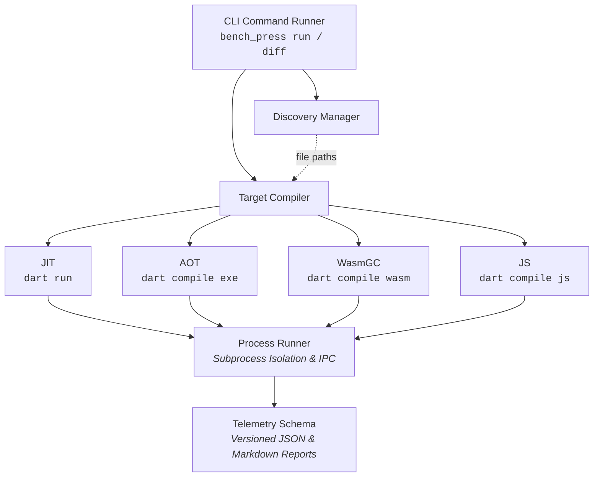

# Architecture & Statistical Methodology

This document details the compiler mechanics, statistical foundations, and architectural design principles underpinning `package:bench_press`.

---

## 1. Motivation: Benchmarking in Modern Optimizing Runtimes

Historically, Dart benchmarking was designed for single-target VM JIT execution. Today, Dart applications execute across four distinct compilation targets:

* **Native JIT** (`dart run`): Dynamic JIT with runtime profiling, tiered compilation, and runtime deoptimization.
* **Native AOT** (`dart compile exe`): Ahead-of-time whole-program compilation with global devirtualization, aggressive inlining, and type feedback specialization.
* **WebAssembly** (`dart compile wasm`): WasmGC bytecode execution with static dispatch, struct-based object layouts, and linear memory operations.
* **Web JavaScript** (`dart compile js`): Whole-program optimization with minification, tree-shaking, and JS engine JITs (V8, JavaScriptCore, SpiderMonkey).

In modern optimizing compilers, naive benchmark loops often measure 0 ns simply because dead code elimination removes the computation entirely. `bench_press` was engineered from first principles to provide robust compiler barriers, adaptive warmup detection, and multi-target orchestration.

---

## 2. Core Primitives & Compiler Barriers

### `Blackhole` Dead Code Elimination (DCE) Barrier

Optimizing compilers track dataflow dependencies. If a function's return value is not consumed or stored into an externally observable sink, the compiler's optimization pipeline (e.g. LLVM, Binaryen, or V8 TurboFan) can eliminate the loop body entirely:

```dart
// DCE Hazard: Compiler can eliminate the entire loop in AOT / Wasm
for (var i = 0; i < count; i++) {
  parser.parse(bytes);
}

// Protected: Blackhole forces the compiler to compute and retain the result
for (var i = 0; i < count; i++) {
  Blackhole.consume(parser.parse(bytes));
}
```

#### Mechanical Implementation

`Blackhole` implements an opaque, non-allocating static sink:

1. **8-Slot Static Ring Buffer**: Values are written to an internal static array (`_sink[_index++ & 7] = value`). Because the sink index mutates across loop iterations, optimizing compilers cannot prove the sink writes are redundant or invariant.
2. **Cross-Backend Inlining Pragmas**: Specialized pragmas ensure the wrapper method is inlined without call overhead:
   * `@pragma('vm:prefer-inline')` (VM JIT & AOT)
   * `@pragma('wasm:prefer-inline')` (WasmGC)
   * `@pragma('dart2js:prefer-inline')` (JavaScript)
3. **Primitive Overloads**: Dedicated methods (`consumeInt`, `consumeDouble`, `consumeBool`, `consumeString`, `consumeObject`) avoid boxed wrapper allocations for primitive data types.
4. **Terminal Drain**: `Blackhole.drain()` computes a bitwise checksum across all sink slots and resets the state between trials to guarantee clean memory isolation.

---

## 3. Batch Timing & Timer Quantization

### Monomorphic Inner Batch Loops

Measuring microsecond or nanosecond operations with individual timestamp reads introduces severe measurement distortion:

* **Timer Resolution & Spectre Mitigations**: Operating system and browser clocks are frequently quantized (e.g., to 1 ms in web browsers or 100 ns on desktop OSs) to mitigate hardware timing side-channels.
* **Timer Read Overhead**: A standard clock query (e.g. `Stopwatch.elapsedTicks` or `clock_gettime`) can take 15–30 ns—often longer than the operation being measured.

#### The `bench_press` Approach

1. **Automatic Calibration**: `bench_press` dynamically calibrates the inner batch size `N` during initial warmup so that each batch execution takes at least 100 ms. At 100 ms duration, a 1 µs timer resolution represents less than 0.001% measurement uncertainty.
2. **Single Monotonic Read**: The high-resolution monotonic clock is queried once before the batch and once after. Mean iteration latency is computed by dividing batch duration by `N`.
3. **Monomorphic Dispatch**: The inner batch loop executes directly against the concrete benchmark instance, preserving monomorphic inline caches (ICs) and eliminating polymorphic dispatch overhead.
4. **No Empty Loop Subtraction**: `bench_press` intentionally avoids subtracting empty loop baselines. On modern superscalar processors with out-of-order execution and multiple ALU ports, loop induction variables execute in parallel with payload instructions, making empty-loop arithmetic scientifically invalid.

---

## 4. Statistical Engine & Warmup Convergence

### Adaptive Steady-State Warmup Detection (RBF Kernel MMD + SEM Relative Error)

Fixed warmup iteration counts (e.g., "always run 10 warmup rounds") are inherently unreliable: JIT compilers, runtime inline caches, and OS frequency governors stabilize at different rates depending on machine load and payload complexity.

`bench_press` implements an adaptive self-stopping detector:

1. **Sliding Window Sampling**: Collects measurement trials across consecutive sliding windows of size $W$ (default: 10), evaluated at half-window strides (windowSize ~/ 2).
2. **Maximum Mean Discrepancy (MMD)**: Evaluates the statistical distance between consecutive sliding windows using a Gaussian Radial Basis Function (RBF) kernel:

   $$
   k(x, y) = \exp\left(-\frac{\|x - y\|^2}{2\sigma^2}\right)
   $$

   where bandwidth $\sigma$ is computed dynamically using the median pairwise distance heuristic (with mean absolute difference fallback on ties).
3. **Standard Error of the Mean (SEM) Relative Error Check**: Primary convergence condition requiring that sample uncertainty is sufficiently narrow relative to the mean:

   $$
   1.96 \times \text{SEM} \le \text{maxSemRelativeError} \times \bar{x}
   $$

4. **Stationarity Verification**: Secondary check ensuring distribution shift between windows is bounded ($\text{MMD} \le 0.25$).
5. **Bounded Patience Budget**: Limits warmup exploration to a configurable budget (default: 200 trials). If convergence is not reached within budget, the runner selects the historically best MMD window and flags the benchmark as `isStable: false` for CI inspection.

---

### Ratio Confidence Intervals via Fieller's Theorem

When comparing two benchmark executions (Baseline $A$ vs. Candidate $B$), standard arithmetic error propagation fails because the ratio of two normally distributed random variables follows a non-Gaussian distribution.

`bench_press` computes exact 95% confidence intervals on the speedup ratio $R = \bar{x}_A / \bar{x}_B$ using **Fieller's Theorem**:

$$
\text{CI}_{95\%} = \frac{R \pm t_{\text{crit}} \sqrt{(1 - g) \frac{s_A^2}{n_A \bar{x}_B^2} + \frac{s_B^2 R^2}{n_B \bar{x}_B^2}}}{1 - g}
$$

where $g = \frac{t_{\text{crit}}^2 s_B^2}{n_B \bar{x}_B^2}$. If $g \ge 1$ (indicating the denominator variance is too high for a bounded ratio), `bench_press` gracefully reports ratio bounds as indeterminate rather than producing false mathematical certainty.

---

## 5. Multi-Runtime Orchestration Architecture



1. **Discovery**: Scans designated benchmark directories or files matching `*benchmark*.dart`.
2. **Compilation**: Dispatches target files to the appropriate compiler backends in parallel, generating optimized standalone artifacts (`.exe`, `.wasm`, `.js`).
3. **Execution**: Executes each target in an isolated subprocess to guarantee clean heap state, capturing structured JSON streams enclosed within delimiter markers (`<<<BENCH_PRESS_JSON_START>>>`).
4. **Aggregation**: Deep-merges results into a canonical `BenchmarkSuiteResult` keyed by `${name}:${target}`.

---

## 6. References & Prior Art

`bench_press` builds upon established statistical and virtual machine benchmarking literature:

* **Warmup & Steady-State Convergence**:
  * Georges, Buytaert, & Eeckhout, [Statistically Rigorous Java Performance Evaluation](https://doi.org/10.1145/1297027.1297033) (OOPSLA 2007)
  * Kalibera & Jones, [Rigorous Benchmarking in Reasonable Time](https://doi.org/10.1145/2464157.2464160) (ISMM 2013)
  * Barrett et al., [Virtual Machine Warmup Blows Hot and Cold](https://doi.org/10.1145/3133882) (OOPSLA 2017)
* **Kernel Two-Sample Testing (MMD)**:
  * Gretton, Borgwardt, Rasch, Schölkopf, & Smola, [A Kernel Two-Sample Test](https://jmlr.org/papers/v13/gretton12a.html) (JMLR 2012)
* **Ratio Confidence Intervals**:
  * Fieller, E. C., [Some Problems in Interval Estimation](https://doi.org/10.1111/j.2517-6161.1954.tb00159.x) (JRSS 1954)
